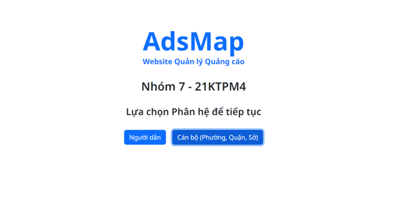
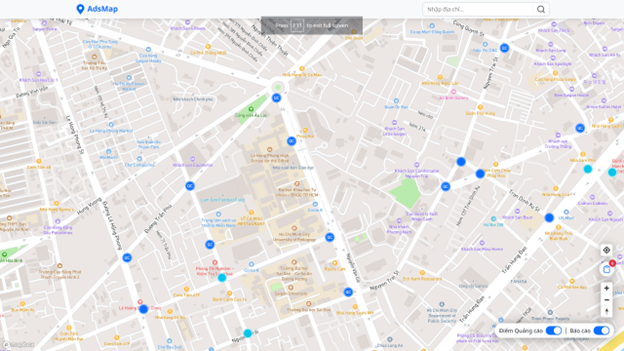
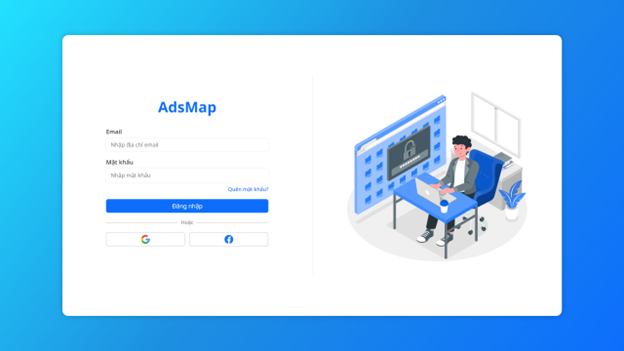

# Ads Management - Hệ thống Quản lý bảng quảng cáo

## 1. Giới thiệu
Một dự án hỗ trợ quản lý quảng cáo, với 2 phân hệ: người dân và cán bộ. Phân hệ người dân có thể xem, gửi báo cáo/góp ý liên quan đến những quảng cáo trên địa bàn thành phố. Ngoài ra, các tổ chức, công ty cũng có thể liên lạc với các phân hệ cán bộ để yêu cầu được đăng quảng cáo ở những địa điểm thuộc thành phố. Bên cạnh đó, phân hệ cán bộ có thể nhận và xem xét các báo cáo/góp ý từ người dân, cũng như có quyền xem và gửi yêu cầu thay đổi nội dung quảng cáo lên cấp trên.

## 2. Thành viên
- 21127367 - Đỗ Thế Nghĩa - Vai trò: Trưởng nhóm
- 21127517 - Nguyễn Anh Khoa - Vai trò: Lập trình viên Front-end và Back-end
- 21127604 - Nguyễn Lâm Hải - Vai trò: Lập trình viên Back-end
- 21127013 - Nguyễn Phú Minh Bảo - Vai trò: Lập trình viên Back-end

## 3. Tech Stack
### Backend:
- ExpressJS: Được sử dụng làm framework back-end để xử lý các yêu cầu HTTP, quản lý dữ liệu và tương tác với cơ sở dữ liệu.
- Node.js: Vì Express.js được xây dựng trên nền tảng Node.js, bạn sẽ cần cài đặt Node.js trên máy chủ của bạn để chạy ứng dụng Express.
- Database: MongoDB.
### Frontend:
- HTML (HyperText Markup Language): Được sử dụng để cấu trúc nội dung của trang web.
- CSS (Cascading Style Sheets): Được sử dụng để thiết kế các phần tử HTML.
### Các công cụ khác:
- Version control - Github: để quản lý các thay đổi trong code.

## 4. Screenshots

